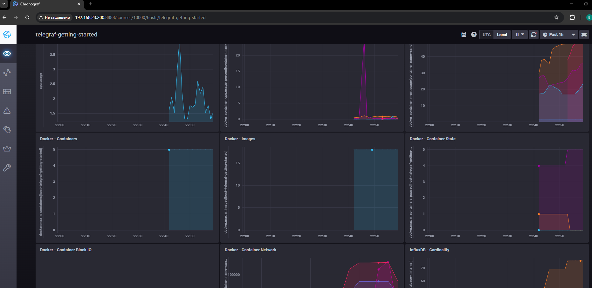
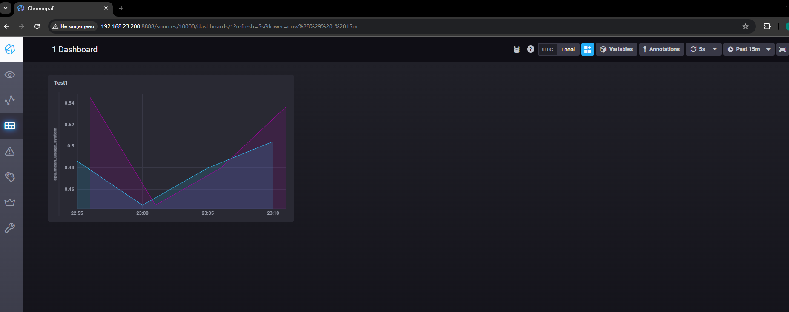
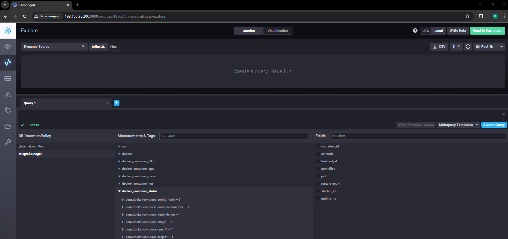

## Домашнее задание к занятию "13.Системы мониторинга" - Айткожоев Бактыбек

## Обязательные задания

1. Вас пригласили настроить мониторинг на проект. На онбординге вам рассказали, что проект представляет из себя 
платформу для вычислений с выдачей текстовых отчетов, которые сохраняются на диск. Взаимодействие с платформой 
осуществляется по протоколу http. Также вам отметили, что вычисления загружают ЦПУ. Какой минимальный набор метрик вы
выведите в мониторинг и почему?

```
Для настройки эффективного мониторинга вычислительной платформы я бы применил комбинированный подход, на основе двух методологиях: 
USE (для ресурсов) - Так как платформа выполняет тяжелые вычисления и сохраняет файлы, крайне важно следить за состоянием «железа»
RED (для сервиса) - Поскольку взаимодействие идет по HTTP, нам нужно понимать «здоровье» API и клиентский опыт.

Мой минимальный набор:
CPU Load (нагрузка).
Disk Space / Inodes (Свободное место для отчетов. Для текстовых отчетов критично количество файлов (Inodes), а не только объем в гигабайтах. 
    Если отчетов много и они маленькие, диск может «заполниться» по количеству файлов гораздо раньше, чем по объему.).
HTTP Error Rate (качество ответов).
HTTP Response Time (скорость выдачи отчетов).
Queue Length  (очередь вычислений): Если запросов на вычисления поступает больше, чем CPU может обработать в моменте, формируется очередь. 
    Рост этой очереди — главный опережающий индикатор того, что пора масштабироваться (Auto-scaling).
```

#
2. Менеджер продукта посмотрев на ваши метрики сказал, что ему непонятно что такое RAM/inodes/CPUla. Также он сказал, 
что хочет понимать, насколько мы выполняем свои обязанности перед клиентами и какое качество обслуживания. Что вы 
можете ему предложить?
```
Менеджер продукта нужно знать, доволен ли клиент. 
Для него сделаем Dashboard «Здоровье продукта» (Business-level Metrics) по 
 методологии SRE (Site Reliability Engineering), а именно к концепциям SLI и SLO

Показатель (SLI)	
Доступность (Availability) - «Какая часть запросов клиентов завершилась успешно?»	(Если клиент не может отправить запрос или получить отчет, сервис для него «лежит».)
Скорость выдачи (Latency)	- «Как быстро клиент получает свой отчет?» (Мы ставим цель: «95% отчетов должны быть готовы быстрее, чем за 30 секунд». 
    Если дольше — клиент уходит к конкурентам.
Успешность отчетов (Success Rate)	- «Сколько отчетов из заказанных реально сохранились без ошибок?»	(Это показатель качества самой услуги. 
    Ошибка в расчетах — это прямой негатив клиента.)
Очередь ожидания (User Wait Time)	- «Сколько клиент ждет, пока его задача вообще начнет считаться?»	(CPU может быть занят на 100%, но если клиент ждет в очереди 5 минут — это плохой сервис.)

Внедрение SLO 
Чтобы понимать, выполняем ли мы обязанности, предложу зафиксировать SLO (Service Level Objectives).
SLO: «99% всех запросов за месяц должны быть успешными».
1 % выделяется на техническое обслуживание и на ошибки.
У нас «запас» 1% ошибок, и мы его исчерпали то мы нарушаем обязательства перед клиентами. В этом месяце мы не выпускаем новые фичи, а занимаемся только стабильностью».
```
#
3. Вашей DevOps команде в этом году не выделили финансирование на построение системы сбора логов. Разработчики в свою 
очередь хотят видеть все ошибки, которые выдают их приложения. Какое решение вы можете предпринять в этой ситуации, 
чтобы разработчики получали ошибки приложения?
```
Я предложу использовать TICK-стек. Настрою агент Telegraf для сбора логов из Docker-контейнеров, будем сохранять их в InfluxDB 
и визуализируем через Chronograf. 
Для оперативного реагирования настрою бесплатные алерты в Telegram через Kapacitor. Это позволит решить задачу без дополнительных затрат на инфраструктуру
```
#
4. Вы, как опытный SRE, сделали мониторинг, куда вывели отображения выполнения SLA=99% по http кодам ответов. 
Вычисляете этот параметр по следующей формуле: summ_2xx_requests/summ_all_requests. Данный параметр не поднимается выше 
70%, но при этом в вашей системе нет кодов ответа 5xx и 4xx. Где у вас ошибка?
```
Если нет ошибок (4xx/5xx), но показатель «успешности» равен 70%, значит, оставшиеся 30% запросов попадают в другие категории HTTP-ответов, 
которые не учли в числителе. Здесь три вероятные причины:
1. Игнорирование 3xx кодов (Редиректы и Кэширование)
  в формуле в числителе только 2xx, но в summ_all_requests попадают все коды. HTTP 304 (Not Modified): Так как ваша платформа выдает отчеты, браузеры или клиенты могут использовать кэширование. Если отчет не изменился, сервер возвращает 304. Это успешный запрос, но он не входит в 2xx.HTTP 301/302 (Redirects): Возможно, у вас настроен редирекст с http на https или с /reports на /reports/. 
  Решение: Изменить формулу, чтобы учитывать все «хорошие» коды: SLA = summ_2xx_requests + summ_3xx_requests/summ_all_requests
2. Незавершенные (In-flight) запросы и Таймауты 
  Так как вычисления сильно нагружают ЦПУ. Если расчет длится долго, возникает «разрыв» в метриках: Запрос поступил в систему и попал в summ_all_requests (счетчик обращений).Запрос еще не завершился (он висит в очереди или обрабатывается процессором). В числитель 2xx он попадет только после завершения. Если система мониторинга считает это «в моменте», то при постоянном потоке тяжелых задач всегда будете видеть заниженный SLA, так как значительная часть запросов находится «в работе».  
```
#
5. Опишите основные плюсы и минусы pull и push систем мониторинга.
```
Плюсы push-модели:
  упрощение репликации данных в разные системы мониторинга или их резервные копии
  более гибкая настройка отправки пакетов данных с метриками
  UDP — это менее затратный способ передачи данных, из-за чего может возрасти
  производительность сбора метрик
Минусы:
  Риск «само-DDoS»: Если 1000 серверов одновременно перезагрузятся и начнут активно спамить метриками, сервер мониторинга может «лечь» под нагрузкой.
  Сложность определения состояния (Liveness): Если сервер перестал получать данные, он не знает: то ли приложение упало, то ли это просто сетевая проблема на стороне клиента.
  Трудности отладки: Сложнее понять, что именно отправляет приложение, не имея доступа к его внутренним логам или коду.

Плюсы pull-модели:
  легче контролировать подлинность данных
  можно настроить единый proxy server до всех агентов с TLS
  упрощённая отладка получения данных с агентов
Минусы:
  Проблемы с сетью (NAT/Firewall): Сервер мониторинга должен иметь сетевой доступ к каждому приложению. Это сложно реализовать, если приложения находятся за NAT или в динамических сетях.
  Сложность с динамической инфраструктурой: Требуется система Service Discovery (например, через Kubernetes API или Consul), чтобы сервер узнавал о появлении новых инс тансов.
```
#
6. Какие из ниже перечисленных систем относятся к push модели, а какие к pull? А может есть гибридные?
    - Prometheus      - Pull
    - TICK            - Push
    - Zabbix          - Hybrid
    - VictoriaMetrics - Hybrid
    - Nagios          - Hybrid
#
7. Склонируйте себе [репозиторий](https://github.com/influxdata/sandbox/tree/master) и запустите TICK-стэк, 
используя технологии docker и docker-compose.

В виде решения на это упражнение приведите скриншот веб-интерфейса ПО chronograf (`http://localhost:8888`). 

P.S.: если при запуске некоторые контейнеры будут падать с ошибкой - проставьте им режим `Z`, например
`./data:/var/lib:Z`


#
8. Перейдите в веб-интерфейс Chronograf (http://localhost:8888) и откройте вкладку Data explorer.
        
    - Нажмите на кнопку Add a query
    - Изучите вывод интерфейса и выберите БД telegraf.autogen
    - В `measurments` выберите cpu->host->telegraf-getting-started, а в `fields` выберите usage_system. Внизу появится график утилизации cpu.
    - Вверху вы можете увидеть запрос, аналогичный SQL-синтаксису. Поэкспериментируйте с запросом, попробуйте изменить группировку и интервал наблюдений.

Для выполнения задания приведите скриншот с отображением метрик утилизации cpu из веб-интерфейса.



#
9. Изучите список [telegraf inputs](https://github.com/influxdata/telegraf/tree/master/plugins/inputs). 
Добавьте в конфигурацию telegraf следующий плагин - [docker](https://github.com/influxdata/telegraf/tree/master/plugins/inputs/docker):
```
[[inputs.docker]]
  endpoint = "unix:///var/run/docker.sock"
```

Дополнительно вам может потребоваться донастройка контейнера telegraf в `docker-compose.yml` дополнительного volume и 
режима privileged:
```
  telegraf:
    image: telegraf:1.4.0
    privileged: true
    volumes:
      - ./etc/telegraf.conf:/etc/telegraf/telegraf.conf:Z
      - /var/run/docker.sock:/var/run/docker.sock:Z
    links:
      - influxdb
    ports:
      - "8092:8092/udp"
      - "8094:8094"
      - "8125:8125/udp"
```

После настройке перезапустите telegraf, обновите веб интерфейс и приведите скриншотом список `measurments` в 
веб-интерфейсе базы telegraf.autogen . Там должны появиться метрики, связанные с docker.




